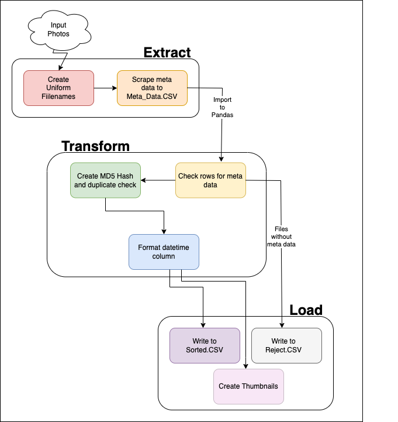

## Images & Metadata ETL
### Contributors:

- [Jess Schueler](https://github.com/jessgschueler)

- [Bri Chavez](https://github.com/BriChavez)

- [Jarret Jeter](https://github.com/jarretjeter)

- [Dylan Peterson](https://github.com/DyPeterson)

### Description

A [Data Stack Academy](https://www.datastack.academy/) team week project. In which we grab ~100 personal cellphone pictures and their metadata (things like date it was taken and image resolution) that are natively stored within the images themselves. We then sort and clean them into new data-set(s) using various techniques we have learned over the first 4 weeks of the course.

### Technologies Used:
- [Python](https://www.python.org/)
- [JupyterLabs](https://jupyter.org/)
- [Pandas](https://pandas.pydata.org/)
- [Pillow](https://pillow.readthedocs.io/en/stable/)
- [Exif](https://pypi.org/project/exif/)
- [glob](https://docs.python.org/3/library/glob.html)
#### Programs used:

- [Visual Code Studio](https://code.visualstudio.com/)

- [Windows Terminal](https://apps.microsoft.com/store/detail/windows-terminal/9N0DX20HK701?hl=en-us&gl=US) ( Running: [WSL2](https://docs.microsoft.com/en-us/windows/wsl/install) ([ubuntu 20.04](https://releases.ubuntu.com/20.04/)))

- [GitBash](https://git-scm.com/)

### Setup & Installation:

1. Through the terminal like [GitBash](https://git-scm.com/downloads)

	2. Open the terminal and navigate to where you would like the new project to be using `cd` commands. Its also recommended that you make a new directory using `mkdir *directory-name*`.

	3. Clone the repository using the command `git clone https://github.com/jessgschueler/team-week1.git`

	4. After cloning the directory it will appear in the directory that your terminal is set to. So make sure you are in the directory that you want this project copied to.

	5. Once this project is cloned you can navigate to that folder within your terminal and create a virtual environment `python3.7 -m venv *any-name*`. Now activate the venv with `source *any-name*/bin/activate`

	6. Install requirements in venv `pip install -r requirements.txt`

	7. Download the data by running the `get_data.sh` either by clicking it or running in the terminal.

	8.  `code .` to open in default coding software.

2. Through github.com

	3. Go to the project's directory page **[HERE](https://github.com/jessgschueler/team-week1.git)**

	4. Click the green `code` button to open the drop-down menu.

	5. At the bottom of the menu will have *Download Zip*. Go ahead and click it to download the project.

	6. Once downloaded find the `.zip` file and right-click it to bring up the menu. Within that menu click `Extract Here` to extract it in the current folder or click `Extract Files...`to select which folder you would like the project in.

	7. Once the project has been extracted, locate the folder in a terminal and open it with `code .` .

### Link to project on GitHub

  
[https://github.com/jessgschueler/team-week1.git](https://github.com/jessgschueler/team-week1.git)

### Details
With this group project for [Data Stack Academy](https://www.datastack.academy/) we each contributed around 20 photos to a google cloud repository. The code within this repository takes all those photos and extracts their metadata. With that metadata the code puts it into a csv file. From there the code take the csv and runs transformations and cleaning on the dataset and outputs several new datasets. Establishing itself as an ETL.

The group that worked on this created a plan to complete this project in the deadline of 1 week. Each group member contributed to each step of the process, keeping constant communication and peer support to meet the deadline.

The group also familiarized ourselves with new technologies and took time to understand the new technologies. This includes planning tools and python modules. The group ended up using a Kanban board for our planning stage, which ended up being a very useful tool for tracking our progress with the project.

This diagram shows our ETL process:

### Known Bugs

The thumbnail creator function only creates thumbnails for 4 images.

## Future Features
- Sort photos by gps location and return where in the world those gps locations are.
- Change our initial metadata pull function to include more data.
- Allow photo rename function to be ran more than one time.

### Copyright 2022

Permission is hereby granted, free of charge, to any person obtaining a copy of this software and associated documentation files (the "Software"), to deal in the Software without restriction, including without limitation the rights to use, copy, modify, merge, publish, distribute, sublicense, and/or sell copies of the Software, and to permit persons to whom the Software is furnished to do so, subject to the following conditions:

The above copyright notice and this permission notice shall be included in all copies or substantial portions of the Software.

THE SOFTWARE IS PROVIDED "AS IS", WITHOUT WARRANTY OF ANY KIND, EXPRESS OR IMPLIED, INCLUDING BUT NOT LIMITED TO THE WARRANTIES OF MERCHANTABILITY, FITNESS FOR A PARTICULAR PURPOSE AND NONINFRINGEMENT. IN NO EVENT SHALL THE AUTHORS OR COPYRIGHT HOLDERS BE LIABLE FOR ANY CLAIM, DAMAGES OR OTHER LIABILITY, WHETHER IN AN ACTION OF CONTRACT, TORT OR OTHERWISE, ARISING FROM, OUT OF OR IN CONNECTION WITH THE SOFTWARE OR THE USE OR OTHER DEALINGS IN THE SOFTWARE.

### Instructor Recommendations

- In `main.py` is better to create a function called `main()` (at the very end that calls all the other functions) in order. This is the main _"pipeline"_ function the calls all other functions. Currently, each function is called right after its declaration which could get messy when your code grows.

- Some functions have their input _hard coded_; for example the `img_filepaths()` hard codes the directory name to _"./images"_. It's always better to define function parameters which are passed by the caller. For example this function should be something like `img_filepaths(dirname)`. **Generally** in a pipeline, the output of one function is the input parameter of the next one. Go through and change this for all the applicable functions.

- Similarly as above, most of the functions use global variable. It's better for function to define all their input as parameters instead of referencing them as global variable. This is for two reason. Global variables get very hard to track when you are debugging. As your code grows, it gets difficult to see where these variables are being changed. Functions must also return the variables that they are changing. By using this technique, the overall `main()` clearly shows what's being passed into each function and what gets returned.

- A general design tip is to use JSON files versus CSVs to store your files and their metadata. You have observed that your data is _semi-structured_; meaning that images have different metadata columns and not all of them are always present. This sort of data makes a better design choice for using JSON files. These files are also _semi-structures_ where every row has different columns (aka metadata). Try saving your intermediate files as JSON Row files and only impose a rigid structure (like CSVs) when you're writing to the database table

- One of the main prompts that wasn't completed is to write the final output into a database table. Write your good and reject Dataframes into MySQL or MariaDB.

- Small things:
  - On some lines the code comment is not indented the same as the code block its in.
  - It's not required, but it's better not to have spaces in dict key names. Use the same naming convention as variable names, ie: _"file_name"_
